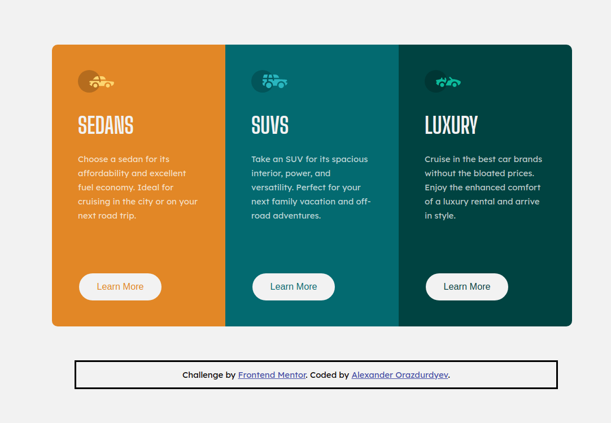

# Frontend Mentor - 3-column preview card component solution

This is a solution to the [3-column preview card component challenge on Frontend Mentor](https://www.frontendmentor.io/challenges/3column-preview-card-component-pH92eAR2-). Frontend Mentor challenges help me improve my coding skills by building realistic projects. 

## Table of contents

- [Overview](#overview)
  - [The challenge](#the-challenge)
  - [Screenshot](#screenshot)
  - [Links](#links)
- [My process](#my-process)
  - [Built with](#built-with)
  - [What I learned](#what-i-learned)
  - [Useful resources](#useful-resources)
- [Author](#author)
- [Acknowledgments](#acknowledgments)

## Overview

### The challenge

Users should be able to:

- View the optimal layout depending on their device's screen size (mobile - 375 viewport width, desktop - 1440 viewport width)
- See hover states for interactive elements

### Screenshot

### Links

- Solution URL: [Add solution URL here](https://your-solution-url.com)
- Live Site URL: [Github Pages](https://icewarrior01.github.io/3-Column-Preview-Card-Component/)

## My process

### Built with

- Semantic HTML5 markup
- CSS custom properties
- Mobile-first workflow

### What I learned

I learned how to create mobile-first project with media queries

### Useful resources

- [CSS Tricks - Media Queries for standard devices](https://css-tricks.com/snippets/css/media-queries-for-standard-devices/) - This helped me understand media queries for standard devices. I really liked this pattern and will use it going forward.
- [CSS Tricks - A Complete Guide to CSS Media Queries](https://css-tricks.com/a-complete-guide-to-css-media-queries/) - This is an amazing article which helped me understand how to use media queries too.
- [MDN - Using media queries](https://developer.mozilla.org/ru/docs/Web/CSS/Media_Queries/Using_media_queries) - it helped me to understand media queries too.
- [W3Schools - CSS media query](https://www.w3schools.com/cssref/css3_pr_mediaquery.asp) - and it helped me understand media queries too.
- [Meyerweb - CSS Reset](https://meyerweb.com/eric/tools/css/reset/) - it helped to reset standard styles.

## Author

- Frontend Mentor - [@yourusername](https://www.frontendmentor.io/profile/yourusername)

## Acknowledgments

Thanks to Frontend Mentor for useful practice for beginner Front-End web developers.
